# IIT Delhi Campus Hub ("Garam Khoon") — Full Reference App Audit, Working Analysis & Fixes Report

> **Target URL Analyzed:** `https://iitd-events-app.netlify.app/`  
> **Target Project in Workspace:** `LOOP` (`/loop-app` — Expo React Native + Firebase Firestore)  
> **Author:** Antigravity Engineering  
> **Status:** Complete Technical Decomposition & Roadmap

---

## 1. Executive Summary

The reference application, branded as **"Garam Khoon — IIT Delhi Campus Hub"**, is an all-in-one web portal designed specifically for the IIT Delhi campus community. Rather than functioning solely as a passive event calendar, it positions itself as an active **campus operating system** combining:
1. **Event Discovery & Fast-Track Ticketing** (Priority Passes, live gate headcount tracking, gate scanner simulation).
2. **Campus Bazaar** (Zero-commission peer-to-peer marketplace for hostel room transitions, coolers, cycles, appliances, and books).
3. **Student Directory & Social Lounges** (Verified student directory, 1-on-1 DMs, hostel common-room chatrooms, and friend activity feeds).
4. **Celebrations & Campus Culture Hub** (Automated fest countdowns, campus birthday cake celebrations, placement & academic kudos, BSW positivity wall, and 24x7 BSW emergency helpline).
5. **Digital IITD Identity & Kerberos Simulation** (Hostel crests, department decoding from entry numbers, barcode/QR identity passes).

While the user interface and cultural resonance are exceptional, our code audit of the production bundle revealed **critical architectural gaps, data persistence bugs, mock limitations, and UX edge cases**. 

This report provides a granular analysis of all working mechanics, exposes all bugs with exact fixes, and lays out a strategic integration roadmap for **LOOP**.

---

## 2. Complete Feature & Working Decomposition

```mermaid
graph TD
    App[Garam Khoon Campus Hub] --> Events[1. Events Feed & Fast-Track Pass]
    App --> Bazaar[2. Campus Bazaar P2P Marketplace]
    App --> Social[3. Social, Directory & Hostel Lounges]
    App --> Celeb[4. Celebrations, Kudos & BSW Wall]
    App --> ID[5. Student ID & Kerberos Profile]

    Events --> QRPass[Dynamic QR Pass & Token #]
    Events --> GateHeadcount[Live Gate Headcount & Door Scanner]
    Events --> FastFilters[1-Click Fast Filters: Food, Pass, Today]

    Bazaar --> P2PListings[Appliance, Cycle, Book Listings]
    Bazaar --> WhatsAppChat[1-Click Direct WhatsApp Seller Chat]
    Bazaar --> Bargain[In-App Price Bargaining / Offer Flow]

    Social --> Directory[Hostel & Branch Search]
    Social --> DMs[1-on-1 Direct Chat Threads]
    Social --> Lounges[Girnar, Himadri & Freshers Lounges]

    Celeb --> Countdowns[RDV / Tryst / Sportech Countdowns]
    Celeb --> Bdays[Birthday Alerts & Virtual Cake Slices]
    Celeb --> Milestones[Placement & GSoC Kudos]
    Celeb --> Positivity[BSW Chai Bhaiya Gratitude Wall]
    Celeb --> SOS[BSW 24x7 Mental Health Helpline]
```



---

### Module 1: Events Feed & Gate Pass Ticketing System

#### A. Core Features & Capabilities
* **Categorized Discovery:** Boards (`BRCA`, `BSA`, `BSW`, `CAIC`, `BSP`), Fests (`Rendezvous`, `Tryst`, `Sportech`, `Literati`, `Speranza`), and Clubs (`DevClub`, `Music Club`, `PFC`, `DebSoc`, `Robotics Club`, etc.).
* **1-Click "Fast Filters":**
  * *Happening Today* (Filters events matching current day).
  * *Free Food / Refreshments* (Extracts refreshment keywords).
  * *Fast-Track Pass Available* (Only events offering direct gate entry tokens).
  * *Certified Workshop* (Events issuing formal certificates).
* **Guaranteed Priority Pass Modal (`T0`):**
  * **Dynamic Pass Token:** Unique token string generated per student (e.g. `RDV-VIP-1034`).
  * **Gate & Walking Navigation:** Identifies exact entry gates (e.g. *Main Ground OAT Gate 2* vs *General Walk-in Gate*) and calculates walking duration from the user's registered hostel (e.g. *"5 min walk from Girnar"*).
  * **Live Gate Headcount Bar:** Real-time capacity gauge (`2,280 / 2,500 Inside (91%)`) with danger thresholds (`Filling Fast`, `Nearly Full`).
  * **Volunteer Door Scanner & Verifier:** Embedded interactive scanner simulating volunteer barcode verification at the entrance; increments check-in counts live.
  * **Digital Pass Exports:** Buttons for Apple Wallet (`.pkpass`), Google Wallet, and WhatsApp sharing.

#### B. Working Mechanics in Code
* Passes calculate tokens deterministically:
  $$\text{Token} = 1000 + (\text{hashCode}(\text{entryNo}) \pmod{900})$$
* Gate capacity warnings trigger dynamic color transitions:
  * $\ge 90\%$: Crimson badge (`border-rose-500/25`, `bg-rose-500`)
  * $85\% - 89\%$: Warning amber (`border-blue-500/30`, `bg-blue-500`)
  * $< 85\%$: Info blue.

---

### Module 2: Campus Bazaar (Peer-to-Peer Marketplace)

#### A. Core Features & Capabilities
* **Hostel-Centric Buy & Sell:** Second-hand goods traded inside campus with zero commission and zero courier delays.
* **Categories:** `Appliances` (Coolers, kettles), `Cycles` (Hero Sprint, Atlas), `Academics` (Books, drafters, lab coats), `Room Essentials` (Mattresses, laundry hampers, curtains), `Electronics` (Monitors, keyboards, calculators).
* **Listing Details:** Price vs. original retail price, percentage discount calculated, physical condition (`Like New`, `Good`, `Fair`), hostel wing & room number (`Girnar D-204`).
* **1-Click WhatsApp Seller Connect:** Direct deep-link launching WhatsApp chat with pre-filled message:
  ```
  https://api.whatsapp.com/send?phone=+91XXXXXXXXXX&text=Hi [Seller], I am interested in your [Item] listed on Garam Khoon Bazaar for Rs [Price]. Is it still available?
  ```
* **Interactive Bargain / Offer Proposition:** Allows buyers to propose a custom counter-offer directly inside the card (e.g. *"Rohan Verma proposed Rs. 2,800 for Hero Sprint Cycle"*), triggering a seller notification.
* **Post New Listing:** Modal form taking item title, category, price, original price, room number, description, and photos.

---

### Module 3: Student Directory, Social Networking & Hostel Lounges

#### A. Core Features & Capabilities
* **Student Directory (`yN`):** Searchable list of students with badges for department (`Biotech '25`), resident hostel (`Girnar`), mutual friend counts, and connection toggle (`Connect / Friend Request`).
* **1-on-1 Direct Messaging (DMs):** Direct chat modal supporting real-time chat between students with timestamps and message bubbles.
* **Hostel Lounges / Wing Communities:** Group chatrooms:
  * *Girnar Hostel Common Room* (Table tennis bracket, night canteen orders).
  * *Freshers '24 & '25 Mentorship* (BSW counselor hours, minor exam prep).
  * *Himadri Wing Lounge* (Wing study sessions).
* **Friend Activity Feed:** Real-time pulse showing friend interactions (e.g., *"Ananya Sharma RSVP'd for Sunidhi Chauhan Pronite"*, *"Rohan Verma got placed at Google"*).

---

### Module 4: Campus Celebrations, Milestones & Positivity Wall

#### A. Core Features & Capabilities
* **Fest Countdowns (`_u`):** Live countdown timer displaying days, hours, and venue for Rendezvous, Tryst, Sportech, etc.
* **Birthday Alerts (`Vu`):** Campus-wide alerts for students celebrating birthdays today. Includes an interactive **"Send Cake"** action button that increments virtual cake slices and allows students to write public wishes.
* **Career Milestones & Placements (`Lu`):** Celebration feed for batchmates securing job offers (Google, Microsoft, GS), research publications, or GSoC selections, with an interactive **"Kudos / Celebrate"** applause counter.
* **BSW Positivity Wall (`Hu`):** Anonymous or signed gratitude messages celebrating campus unsung heroes:
  * *“Big shoutout to the LHC Chai Bhaiya for serving hot cutting chai at 7:55 AM before every 8 AM class.”*
* **BSW 24x7 SOS Helpline Modal:** Emergency crisis contacts, student counselor desk, IITD hospital ambulance (`011-2659-6100`), and hostel warden directory.

---

### Module 5: Student ID & Kerberos Profile System

#### A. Core Features & Capabilities
* **IITD Kerberos Login Simulation:** Validates entry number structure (`YYYYDDXXXXX`) and auto-decodes:
  * `2021` $\to$ Batch of 2025 (4th Year / Senior)
  * `BB` $\to$ Biochemical Engineering & Biotechnology
  * `CS` $\to$ Computer Science & Engineering
  * `EE` / `E1` / `E2` $\to$ Electrical Engineering
  * Hostels: Girnar, Himadri, Karakoram, Nilgiri, Zanskar, Kailash, etc.
* **Digital Identity Card:** High-contrast card with official IIT Delhi crest, barcode, student photo, Kerberos ID, and hostel emblem.
* **Passes & Bookmarks Wallet:** Centralized repository of all RSVP'd events, gate QR codes, and saved marketplace listings.
* **Theme Switching:** Dark mode (`#09090b` zinc) and light mode (`#f8fafc` slate) with persistent memory.

---

## 3. In-Depth Technical Audit: Bugs, Flaws & Fixes

Our review of the bundled implementation revealed several critical bugs, architectural flaws, and performance bottlenecks in the reference app:

| Issue ID | Area | Severity | Flaw Description | Exact Root Cause in Code | Required Fix |
|---|---|---|---|---|---|
| **BUG-01** | Chat Persistence | **Critical** | Direct DMs and Lounge chats wipe out on browser reload or route switch. | `vj()` (pos 274567) omits `chats` and `lounges` from the payload written to `localStorage`. `yN` keeps messages in local `useState`. | Hoist chat state to global store; persist threads keyed by `chat_${id}` or sync to Firebase Firestore collection. |
| **BUG-02** | Friend Activity | **Medium** | Friend Activity feed (`Z` in `yN`) is completely static and never updates. | Hardcoded array `Z = [{...}]` declared inside `yN` component function. | Derive friend activity dynamically from event RSVPs, marketplace listings, and kudos events. |
| **BUG-03** | Auth Verification | **High** | Kerberos auth is purely cosmetic; any 4-letter string authenticates any entry number. | Client-only `setTimeout()` check with `entryNo.length >= 4`; no Kerberos LDAP or OAuth backend. | Implement actual OAuth / LDAP auth or Firebase Auth with campus email verification (`@iitd.ac.in`). |
| **BUG-04** | QR Pass Forgery | **High** | QR Pass is rendered as an unencrypted static SVG; vulnerable to simple screenshots/forgery. | Passes render SVG `rect` patterns with plaintext token number `C` in DOM. | Generate time-based dynamic OTP / HMAC-signed JWT QR tokens with anti-screenshot watermarks. |
| **BUG-05** | Mobile Viewport Clipping | **Medium** | Bottom list items in Bazaar and Directory are obscured by floating bottom bar. | Bottom bar has `fixed bottom-0 h-18` (72px), but scroll container lacks matching `pb-24` or `safe-area-inset-bottom`. | Add dynamic `paddingBottom: 88` + safe area insets on all mobile scroll views. |
| **BUG-06** | Fest Countdown Drift | **Medium** | Countdown dates are hardcoded to 2025 strings (`2025-10-18T00:00:00`). | Static target dates cause countdown to show negative or expired states once dates elapse. | Pull active fest dates from remote configuration / Firestore collection with recurring yearly fallbacks. |
| **BUG-07** | Image Persistence | **High** | Bazaar and Event posting forms do not upload real image files. | Uses mock Unsplash URLs or un-persisted local `blob:` URLs that fail on reload. | Integrate Cloudinary or Firebase Storage image upload pipeline (already present in LOOP backend!). |
| **BUG-08** | WhatsApp Encoding | **Low** | WhatsApp link fails if seller phone number has leading zeroes or spaces. | String interpolation `${encodeURIComponent(...)}` without normalizing telephone regex `+91`. | Sanitize phone number string with `phone.replace(/[^0-9]/g, '').replace(/^0/, '91')`. |

---

## 4. LOOP (`loop-app`) vs. Reference App Comparison

| Dimension | Reference App (*Garam Khoon*) | Workspace App (*LOOP*) | Integration Opportunity for LOOP |
|---|---|---|---|
| **Tech Stack** | React (Vite) + Tailwind + Lucide Web | React Native (Expo) + TypeScript + Phosphor | Build as universal Native + Web app via Expo |
| **Backend & Persistence** | Single LocalStorage JSON blob (`iitd_garam_khoon_db_v2`) | Firebase Firestore + Firebase Admin + Cloudinary | Connect all features to LOOP's real Firestore backend |
| **Event Pipeline** | Static JSON mock data array | Automated Python Scrapers + Queue Screen + Curate Screen | Live scraped events feed directly into Priority Pass system |
| **Ticketing / Passes** | Mock QR Pass with live gate headcount & scanner | Basic Event Detail Modal without ticketing | **Add Priority Pass, QR tickets, and live venue capacity** |
| **Marketplace (Bazaar)** | Full peer-to-peer campus marketplace with WhatsApp | Not implemented in LOOP | **Port the entire Campus Bazaar into LOOP** |
| **Campus Social & Lounges** | Directory, 1-on-1 DMs, Hostel lounges | Basic Clubs Directory (`DirectoryScreen.tsx`) | **Add Student Directory, Hostel Lounges & Wing DMs** |
| **Campus Celebrations** | Fest Countdowns, Cake Wishes, Placement Kudos, BSW Wall | Basic Campus Pulse notices (`PulseScreen.tsx`) | **Incorporate Fest Countdowns, Bday Cakes & Kudos into Pulse** |
| **Emergency & Welfare** | 24x7 BSW SOS modal with campus numbers | Not implemented | **Add quick BSW SOS action in LOOP TopBar** |

---

## 5. Strategic Roadmap: Porting Garam Khoon Features into LOOP

### Phase 1: High-Impact "Low Hanging Fruit" (Immediate)
1. **Priority Pass & Fast-Track QR System for Events:**
   * Extend LOOP's `EventItem` schema in `loop-app/src/data/events.ts` to include `gate`, `capacity`, `registeredCount`, and `passEnabled`.
   * Create `PriorityPassModal.tsx` in `loop-app/src/components/` with dynamic QR generator (`react-native-qrcode-svg`) and Apple/Google Wallet export.
   * Add the Door Scanner simulation mode for club organizers inside LOOP's Studio Mode (`CurateScreen.tsx`).

2. **24x7 BSW Emergency SOS Quick-Access:**
   * Add a floating or TopBar emergency shield icon in `TopBar.tsx`.
   * Displays instant dialer buttons (`Linking.openURL('tel:01126596100')`) for IITD Ambulance, BSW Counselor, Security Gate, and Hostel Wardens.

3. **Fest Countdowns & Daily Celebrations in PulseScreen:**
   * Integrate live countdown banners for Rendezvous, Tryst, and Sportech at the top of `PulseScreen.tsx`.
   * Add a "Birthdays Today" horizontal carousel with the 1-click "Send Cake 🎂" interaction.

### Phase 2: Campus Bazaar Integration (Medium Term)
1. **Firestore Schema:**
   * Create `/bazaar` collection in Firestore with fields:
     ```typescript
     interface BazaarItem {
       id: string;
       title: string;
       category: 'Appliances' | 'Cycles' | 'Academics' | 'Room' | 'Electronics';
       price: number;
       originalPrice: number;
       condition: 'Like New' | 'Good' | 'Fair';
       hostel: string;
       room: string;
       sellerUid: string;
       sellerName: string;
       sellerPhone: string;
       imageUrl: string;
       status: 'available' | 'reserved' | 'sold';
       createdAt: Timestamp;
     }
     ```
2. **BazaarScreen in LOOP:**
   * Add `BazaarScreen.tsx` with category filter pills, search bar, and item cards.
   * One-tap WhatsApp deep link utilizing `Linking.openURL('whatsapp://send?phone=...&text=...')`.
   * Image upload utilizing LOOP's existing Cloudinary endpoint (`/api/upload` / `package.json`).

### Phase 3: Student Directory & Hostel Lounges (Long Term)
1. **Hostel Lounges (`/lounges` in Firestore):**
   * Real-time group messaging channels for each hostel (Girnar, Nilgiri, Himadri, etc.) powered by Firestore `onSnapshot`.
2. **Student Directory & Verified Student Profiles:**
   * Student profiles stored in Firestore under `/users/{uid}`, verified via `@iitd.ac.in` email tokens.
   * Auto-detection of branch and graduation year from Entry Number.

---

## 6. Key Takeaways & Recommendations

1. **Design & Cultural Polish:** Garam Khoon's success lies in its deep understanding of IIT Delhi life — from LHC Chai Bhaiya shoutouts to cooler handoffs before Delhi summer, Girnar vs. Nilgiri banter, and RDV gate passes.
2. **Architecture:** Rather than relying on fragile single-file client state and LocalStorage, LOOP is perfectly positioned to deliver this vision with **real cloud synchronization, persistent Firestore feeds, authenticated student identities, and offline caching via AsyncStorage**.
3. **Action Plan:** We recommend beginning with **Phase 1** (Priority Passes + Fest Countdowns + BSW SOS in LOOP) to deliver an immediate upgrade to LOOP's current event experience.
