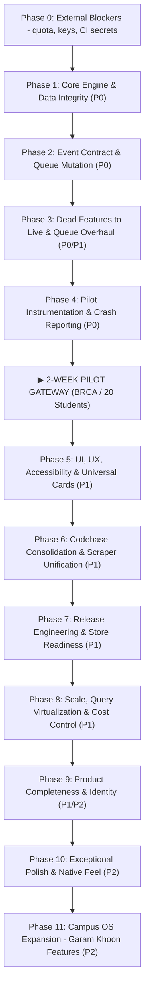

# LOOP IIT Delhi — Complete Master Technical To-Do List & Roadmap Specification

> **Project:** LOOP (`loop-app` — Expo React Native + Firebase Firestore + Vercel Serverless)  
> **Status:** Production Readiness & Phased Execution Plan  
> **Target Audience:** Engineering & Product Leadership  
> **Coverage:**  
> - **47 Original Audit Findings** (`F—01` … `F—47`)  
> - **27 Production-Readiness Findings** (`T—01` … `T—27`)  
> - **4 Exceptional Quality Upgrades** (`X—01` … `X—04`)  
> - **12 Newly Discovered Real-World Findings** (`F—48` … `F—59`)  
> - **4 External Blockers** (`B—01` … `B—04`) — account/quota work no engineer can do in code  
> - **8 "Garam Khoon" Campus Operating System Modules** (`GK—01` … `GK—08`)  
> **Total Items:** **102 items** — 5 verified complete, 4 blocked on account access, 93 open.
>
> **Revision, 5 Sep 2026:** every claim below re-verified against the code and the live system.
> Corrections are marked inline. The three that change priority: F—59 (scraper bypasses the
> moderation queue), F—58 (poster parsing is 100% broken, not merely un-resilient), and F—48
> (the 38s latency was quota throttling, not the fallback model — see B—01).

---

## The Master Phased Architecture Overview



---

## Phase 0: External Blockers (No Code — Account Owner Only)

*Nothing in Phase 1 holds under load until these are cleared. Verified 5 Sep 2026.*

- [ ] **B—01 · Gemini API quota is exhausted (P0)**
  - **Evidence:** `gemini-2.5-flash` returns `HTTP 429 RESOURCE_EXHAUSTED` on every call.
  - **Impact:** This — not model choice — is the root cause of the 36–58s concierge latency
    observed on 4 Sep. Under quota pressure Google throttles rather than refusing, so healthy
    models crawl. Re-measured on 5 Sep with quota partly recovered,
    `gemini-flash-lite-latest` returned in **1.2s**, so F—48's "the fallback takes 38s" is a
    symptom of B—01, not a property of the model.
  - **Fix:** Move the project to a paid Gemini tier, or cut consumption
    (`MAX_EVENTS`, poster-parse frequency). Rotating the key does **not** help — quota is
    per-project, not per-key.
- [ ] **B—02 · Cloudinary API key has no permissions (P0)**
  - **Evidence:** key `4216…719` is rejected for both `actions=["create"]` and `actions=["read"]`.
  - **Impact:** every poster upload fails, in the scraper *and* in Club Studio submit. The
    15 queued events carry no image; the feed shows "NOT AVAILABLE" cards.
  - **Fix:** issue an unrestricted key in the Cloudinary console, then update
    `loop-app/scraper/.env` and the Vercel environment.
- [ ] **B—03 · GitHub Actions repository secrets are unset (P0)**
  - **Impact:** the hosting workflow now fails closed (by design, after the 4 Sep outage where
    CI shipped a bundle with `apiKey:""` over a working site). Nothing deploys from CI until
    these exist.
  - **Fix:** add all `EXPO_PUBLIC_FIREBASE_*` values plus `FIREBASE_SERVICE_ACCOUNT`.
- [ ] **B—04 · Rotate the Gemini key**
  - It shipped inside a published web bundle before 4 Sep. Independent of B—01.

---

## Phase 1: Core Engine & Data Integrity (Immediate Blockers)

*Goal: Stop AI hangs, eliminate 2027 date drift, prevent duplicate events, and fix home feed sorting.*

- [ ] **F—48 · AI Concierge Model Hierarchy & Quota Failover**  
  - **Location:** [`loop-app/api/callGemini.ts`](file:///Users/prathamkathi/Downloads/LOOP/loop-app/api/callGemini.ts#L4)  
  - **Issue:** Primary model `gemini-2.5-flash` returns HTTP 429 `RESOURCE_EXHAUSTED`, so every
    call falls through to the secondary model.  
  - **Correction (measured 5 Sep):** the 36–58s latencies were **throttling under exhausted
    quota, not the fallback model**. With quota partly recovered, `gemini-flash-lite-latest`
    returns in **1.2s** and `gemini-2.5-flash-lite` in **1.1s**. Reordering models is worth doing,
    but it will not keep the concierge fast on its own — **B—01 is the real dependency.**  
  - **Fix:** `TEXT_MODELS = ['gemini-2.5-flash-lite', 'gemini-2.5-flash', 'gemini-flash-lite-latest']`,
    and treat a 429 on every entry as a user-visible "busy, try again" rather than a silent stall.
- [ ] **F—49 · AI Concierge Client Timeout Guard**  
  - **Location:** [`loop-app/src/utils/vercelClient.ts`](file:///Users/prathamkathi/Downloads/LOOP/loop-app/src/utils/vercelClient.ts#L44-L54)  
  - **Issue:** `fetch()` has no abort signal; when the serverless function hangs, the UI stays stuck on "Thinking..." indefinitely.  
  - **Fix:** Add `AbortSignal.timeout(15000)` with a user-friendly fallback error message.
- [ ] **F—50 · Feed Chronology & "FEATURED TONIGHT" Fallback Bug**  
  - **Location:** [`loop-app/src/screens/HomeScreen.tsx`](file:///Users/prathamkathi/Downloads/LOOP/loop-app/src/screens/HomeScreen.tsx#L80-L112)  
  - **Issue:** Events without `startsAt` evaluate to timestamp `0` (1 Jan 1970) and sort to the top (`filtered[0]`). `featured` selects `filtered[0]`, displaying an admissions circular under "FEATURED TONIGHT".  
  - **Fix:** Missing `startsAt` items sort to the bottom (`time = Infinity`). Restrict "FEATURED TONIGHT" strictly to events with `featured: true` OR `startsAt` within 24–48h. Otherwise, hide the section.
- [ ] **F—51 · Scraper 2027 Year Rollover Bug**  
  - **Location:** [`loop-app/scraper/scraper.py`](file:///Users/prathamkathi/Downloads/LOOP/loop-app/scraper/scraper.py#L265)  
  - **Issue:** `if dt.month < now.month: dt = dt.replace(year=year + 1)`. Because today is September 2026, April and August posts got bumped to **2027-04-26** and **2027-08-16** and flooded the upcoming feed.  
  - **Fix:** Remove blind year increment. Only rollover if in Nov/Dec looking at Jan/Feb. Past events must be archived.
- [ ] **F—52 · Semantic Deduplication in Ingestion Pipeline**  
  - **Location:** [`loop-app/scraper/scraper.py`](file:///Users/prathamkathi/Downloads/LOOP/loop-app/scraper/scraper.py#L130-L136)  
  - **Issue:** Deduplication only checked `ig_{ig_post_id}`. Multiple posts for "Debutant 11.0" created duplicate feed entries.  
  - **Fix:** Deduplicate by normalized semantic tuple `(normalized_title, host, normalized_date)`.
- [ ] **F—59 · Scraper bypasses the moderation queue entirely (P0 — new)**  
  - **Location:** [`loop-app/scraper/scraper.py`](file:///Users/prathamkathi/Downloads/LOOP/loop-app/scraper/scraper.py#L248)  
  - **Issue:** the writer sets `"status": "approved",  # Auto-approved for immediate feed visibility`.
    Every scraped post is published straight to the student feed with no human review. This
    silently voids the Staging Queue, the `coordinator` custom claim, and the Firestore rule that
    only permits `pending → approved` — the rules are not bypassed by a client, they are simply
    never exercised, because the Admin SDK writes `approved` directly.  
  - **Why it is P0, not a sub-bullet:** it is the reason surveys, admissions circulars and a
    feedback form reached the live feed on 4 Sep. Fixing `invalid_markers` (F—53) narrows what
    gets in; it does not restore review.  
  - **Fix:** revert to `"status": "pending"`. If unattended publishing is genuinely wanted, make
    it an explicit, separately-gated `--auto-approve` flag with a confidence floor, never the
    default.

- [ ] **F—53 · Scraper Incomplete `invalid_markers`**  
  - **Location:** [`loop-app/scraper/scraper.py`](file:///Users/prathamkathi/Downloads/LOOP/loop-app/scraper/scraper.py#L172-L248)  
  - **Issue:** `"not available"` and `"ongoing"` bypass validation, so non-events pass the gate.  
  - **Fix:** Add `"not available"`, `"ongoing"`, `"tbd"` to `invalid_markers`, and add an
    `"is_event": true/false` classifier to the extraction schema. (Status handling moved to F—59.)
- [ ] **F—54 · Offline Cache Timestamp Deserialization Bug**  
  - **Location:** [`loop-app/src/screens/HomeScreen.tsx`](file:///Users/prathamkathi/Downloads/LOOP/loop-app/src/screens/HomeScreen.tsx#L76), [`App.tsx`](file:///Users/prathamkathi/Downloads/LOOP/loop-app/App.tsx#L95)  
  - **Issue:** `JSON.parse` restores Firestore Timestamps as plain `{ seconds, nanoseconds }` lacking `.toDate()`. `new Date({ seconds })` produces `Invalid Date` (`NaN`), causing all cached events to vanish offline.  
  - **Fix:** Universal parser: `if (s?.toDate) return s.toDate(); if (s?.seconds) return new Date(s.seconds * 1000); return new Date(s);`.
- [ ] **F—55 · Notification Pre-Filtering for Past Events**  
  - **Location:** [`loop-app/src/utils/notifications.ts`](file:///Users/prathamkathi/Downloads/LOOP/loop-app/src/utils/notifications.ts#L46-L105)  
  - **Issue:** Notifications ran on raw `liveEvents`, notifying students about expired April/August events.  
  - **Fix:** Filter `liveEvents` using `isUpcomingOrActive(event)` before generating alerts.
- [ ] **F—56 · Queue Approval `startsAt` Mutation Loss**  
  - **Location:** [`loop-app/src/screens/QueueScreen.tsx`](file:///Users/prathamkathi/Downloads/LOOP/loop-app/src/screens/QueueScreen.tsx#L214-L230)  
  - **Issue:** Editing date/time and approving only updated string fields; `startsAt` remained null.  
  - **Fix:** Parse and persist a valid Firestore `startsAt` `Timestamp` during approval.
- [ ] **F—57 · AI Concierge Raw Markdown Asterisk Rendering**  
  - **Location:** [`loop-app/src/components/AICampusConcierge.tsx`](file:///Users/prathamkathi/Downloads/LOOP/loop-app/src/components/AICampusConcierge.tsx#L52-L177)  
  - **Issue:** Welcome greeting and replies render literal `**Loop AI**` asterisks.  
  - **Fix:** Update welcome text to clean prose; format bold/bullet spans cleanly.
- [ ] **F—58 · Club Studio Poster Parser Fallback Model**  
  - **Location:** [`loop-app/api/parseEventPoster.ts`](file:///Users/prathamkathi/Downloads/LOOP/loop-app/api/parseEventPoster.ts#L44)  
  - **Issue (worse than "no fallback" — verified 5 Sep):** `gemini-2.5-pro` returns
    **HTTP 404 NOT_FOUND** on this API version. It is not rate-limited, it does not exist, so
    Club Studio poster parsing fails **100% of the time** — every coordinator upload falls back
    to manual entry. This is P0, not a resilience nicety.  
  - **Fix:** replace with `gemini-2.5-flash-lite` (verified 1.1s) and add
    `gemini-flash-lite-latest` as fallback. Note `loop-app/scraper/shared.py:138` uses a
    different list again (`gemini-2.5-flash`, `gemini-flash-latest`) — put the model list in
    one shared constant so the three call sites cannot drift.

---

## Phase 2: Event Contract & Queue Mutation (P0)

*Goal: Single source of truth for the event data model and composite indexing.*

- [ ] **F—14 · Standardize Confidence Range**  
  - App and scraper must both store confidence as a float `0.0 – 1.0`.
- [ ] **F—15 · Standardize Document Creation Timestamp**  
  - Both writers must set `createdAt: serverTimestamp()`.
- [ ] **F—20 · Remove Base64 Poster Fallback in Firestore**  
  - Prevent 1 MB document quota breaches; require Cloudinary URLs.
- [ ] **F—26 · Resolve `featured` / `day` / `fillingFast` Field Population**  
  - Formally wire these fields at write time or handle via computed UI states.
- [ ] **F—40 · Replace Free-Text Date/Time Entry in SubmitScreen**  
  - Enforce structured datetime picker in [`SubmitScreen.tsx`](file:///Users/prathamkathi/Downloads/LOOP/loop-app/src/screens/SubmitScreen.tsx) to prevent bad upstream date strings.
- [x] **T—06 · Deploy Composite Indexes in `firestore.indexes.json`** — file exists and is registered  
  - Index `status ASC, startsAt ASC` for ordered feed queries.
- [ ] **Data Cleanup Script · Run `cleanup_feed.py`**  
  - Idempotent maintenance script to purge/archive corrupted 2027 events and duplicate "Debutant 11.0" docs.

---

## Phase 3: Dead Features to Live & Queue Overhaul (P0/P1)

*Goal: Make all interactive UI functional, and give coordinators full access control.*

- [ ] **F—10 · Align Category Vocabulary**  
  - Gemini extraction prompts must strictly output items from `CATEGORIES` array in `categories.ts`.
- [ ] **F—11 · Wire Student Interests to Feed Filtering**  
  - Filtering by "All" must prioritize or filter by `interests` set.
- [ ] **F—12 · Local Calendar & Notification Scheduling**  
  - Schedule reminders via `expo-notifications` on event bookmark save.
- [ ] **F—13 · Drop Past Events in HomeScreen**  
  - Automatically hide events older than 12 hours.
- [ ] **F—16 · Dynamic Data in `PulseScreen.tsx`**  
  - Connect PulseScreen to live Firestore feed instead of static mock data.
- [ ] **F—17 · Dynamic Source Handle in `QueueScreen.tsx`**  
  - Display authentic `@club_handle` instead of "Submitted via App".
- [ ] **F—18 · Remove Hardcoded Fallback Poster in SubmitScreen**  
  - Replace static Ankahi fallback poster with themed category placeholder.
- [ ] **F—19 · True Club Identity Attribution**  
  - Derive host name and avatar from coordinator's verified club claim.
- [ ] **F—21 & F—22 · Shared `onSnapshot` Listener**  
  - Consolidate feed listeners in `App.tsx` with unified state management.
- [ ] **F—23 · User-Facing Error States on Failed Loads**  
  - Show friendly error retry box if Firestore is unreachable.
- [x] **F—24 · Fix `handleNext` Stale Closure in Queue** — done (dead `currentIndex` removed)  
  - Ensure swiping or approving always loads the next item reliably.
- [ ] **F—25 · Soft-Rejection Archive & Undo Capability**  
  - Soft-delete to `status: 'rejected'` with dedicated "Rejected Archive" tab and "Undo to Pending".
- [ ] **F—27 · Remove Scraper Silent Caps**  
  - Log when scraper hits caps instead of silently discarding events.
- [ ] **Queue Lightbox · 1600px High-Res Poster Lightbox**  
  - Full-screen pan/zoom modal for fine poster text inspection.
- [ ] **Queue Editor · Inline Metadata & Contacts Editor**  
  - In-place modal editor for category, WhatsApp contacts, and action URLs before approval.

---

## Phase 4: Pilot Instrumentation & Crash Reporting (P0)

*Goal: Comprehensive observability before exposing the app to campus users.*

- [x] **T—08 · Root `ErrorBoundary` Component** — `src/components/ErrorBoundary.tsx` exists  
  - Catch React render errors and display a recovery screen instead of a blank white screen.
- [ ] **T—09 · Crash Reporting Integration**  
  - Sentry or Crashlytics instrumentation to catch uncaught promise rejections and native exceptions.
- [ ] **T—10 · Firestore Offline Cache Configuration**  
  - Enable offline cache settings in Firebase JS SDK for low-connectivity spots (LHC basements, hostels).
- [ ] **T—11 · Scraper Autonomous Health Heartbeat**  
  - Scraper writes run metrics (`lastRunAt`, `eventsFound`, `eventsQueued`, `status`) to `system/scraper_health`.

---

## ⏸️ 2-WEEK PILOT GATEWAY (BRCA Cultural Apex Body / ~20 Students)

> **Validation Gate:**  
> Verify end-to-end ingestion, coordinator approval, real phone layouts on campus Wi-Fi, and AI concierge query quality under real campus conditions.

---

## Phase 5: UI, UX, Accessibility & Universal Cards (P1)

*Goal: Flawless mobile presentation, accessible touch targets, and category-adaptive cards.*

- [x] **F—28 · Ensure Fonts Render in Production** — done 4 Sep. `firebase.json` ignored `**/node_modules/**`, so Expo's font assets 404'd into the SPA rewrite and decoded as HTML. Verified live: `font/ttf`, magic `0x00010000`  
  - Verify Outfit and Geist TrueType fonts load with HTTP 200 `font/ttf`.
- [ ] **F—29 · WhatsApp Button Touch Target Isolation**  
  - Prevent tap on WhatsApp button from triggering event detail modal.
- [ ] **F—30 · Eliminate Double Image Decode**  
  - Optimize card hierarchy to avoid decoding the same high-res poster twice.
- [ ] **F—31 · Accessibility Sweep**  
  - Ensure all `Pressable` elements have valid `accessibilityLabel` and `accessibilityRole`.
- [ ] **F—32 · Input Font Size >= 16px**  
  - Prevent unwanted viewport zoom on iOS Safari when focusing form fields.
- [ ] **F—33 · Themed Boot Splash Screen**  
  - Eliminate white flash on startup in dark mode.
- [ ] **F—34 · Coordinator Studio Mode Access Gate**  
  - Gate Studio toggle so non-coordinators cannot enter coordinator views.
- [ ] **F—35 · Unique Tab IDs for Student vs Studio**  
  - Disambiguate student home from studio queue to prevent navigation lockups.
- [ ] **F—36 · TopBar Notification Badge Count**  
  - Wire unread notification count directly to the bell icon in `TopBar.tsx`.
- [ ] **F—37 · Dynamic Directory Status Indicators**  
  - Base facility "Open/Closed" badges on live clock and operating hours.
- [ ] **F—38 · Remove Shipped Demo Personas**  
  - Clean out hardcoded test credentials from sign-in modals.
- [ ] **F—39 · Image Fallback Placeholders**  
  - Add `onError` fallbacks to club avatars and directory listings.
- [ ] **F—41 · Resilient Filter State Keying**  
  - Key saved events filter chip by internal ID (`saved`), not display text.
- [ ] **F—42 · Clean Unused Sidebar & Theme Props**  
  - Purge dead properties in layout components.
- [ ] **Universal Cards · Category-Adaptive Metadata Layouts**  
  - Differentiated card styling, primary action buttons, and date lines across all 8 campus categories via `categoryMeta.ts`.

---

## Phase 6: Codebase Consolidation & Scraper Unification (P1)

*Goal: Eliminate technical debt and duplicate scrapers.*

- [ ] **F—43 · Collapse Scraper Entry Points**  
  - Unify disparate scraping scripts into a clean CLI module.
- [ ] **F—44 · Single Canonical Handle List**  
  - Read curated handles dynamically from `docs/insta_ids.md` (45 clubs).
- [ ] **F—45 · Remove Abandoned `gemini_parser.py`**  
  - Eliminate duplicate parser file that used obsolete category vocabularies.
- [ ] **F—46 · Clean Obsolete npm Dependencies**  
  - Remove unused packages (`react-native-svg`, deprecated `@google/generative-ai` from client).
- [ ] **F—47 · CI Quality Checks**  
  - Automated `tsc --noEmit` and linting in GitHub Actions.

---

## Phase 7: Release Engineering & Store Readiness (P1)

*Goal: Prepare app for Apple App Store, Google Play Store, and EAS cloud builds.*

- [ ] **T—01 · Configure iOS Bundle Identifier**  
  - Set `ios.bundleIdentifier: "com.loop.iitd"` in `app.json`.
- [ ] **T—02 · Automatic Native Theme Appearance**  
  - Set `userInterfaceStyle: "automatic"` so native dark mode responds to OS settings.
- [ ] **T—03 · Universal Deep Linking Scheme**  
  - Register `scheme: "loop"` in `app.json` for external routing.
- [ ] **T—04 · Over-The-Air Updates with `expo-updates`**  
  - Ship rapid hotfixes without requiring full app store binary rebuilds.
- [ ] **T—05 · Production Profile in `eas.json`**  
  - Configure production release channels and build credentials.
- [ ] **T—07 · Static Cache Headers in Hosting Config**  
  - Set 1-year immutable cache for hashed assets in `firebase.json`; disable caching for `index.html`.
- [ ] **CI Secrets · Configure GitHub Actions Repository Secrets**  
  - Set `EXPO_PUBLIC_FIREBASE_*` and `FIREBASE_SERVICE_ACCOUNT` in GitHub repo settings.

---

## Phase 8: Scale, Virtualization & Cost Control (P1)

*Goal: Optimize network payload, memory consumption, and query bills.*

- [ ] **T—12 · Enforce Pagination with `limit()`**  
  - Restrict all Firestore queries to limit(20–50) with cursor-based pagination (`startAfter`).
- [ ] **T—13 · Virtualized List Migration (`FlatList`)**  
  - Replace `ScrollView.map()` with `FlatList` in `HomeScreen` and `QueueScreen` to recycle unrendered views.
- [x] **T—14 · Cloudinary Dynamic Image Delivery Optimization** — `src/utils/cloudinary.ts` exists (blocked end-to-end by B—02)  
  - Enforce `f_auto,q_auto,w_800` on all delivery image URLs.
- [ ] **T—15 · Cloud Budget & Quota Alarms**  
  - Set spending thresholds on Google Cloud, Vercel, and Cloudinary.
- [ ] **T—16 · Automated Event Archival & TTL**  
  - Move events older than 30 days to an `archived_events` collection to keep active feed queries lean.

---

## Phase 9: Product Completeness & Identity (P1/P2)

*Goal: Full identity, push notifications, and compliance.*

- [ ] **T—17 · Remote Push Notification Pipeline**  
  - Firebase Cloud Messaging (FCM) / APNs token registration and broadcast sender.
- [ ] **T—18 · Interactive First-Run Onboarding**  
  - Welcome walkthrough for new students to customize their club interests.
- [ ] **T—19 · 1-Tap Event Sharing**  
  - Generate shareable deep-links (`loop.iitd.ac.in/event/:id`) with WhatsApp share integration.
- [ ] **T—20 · Report / Flag Inaccurate Event**  
  - In-app abuse/error reporting button on event detail view.
- [ ] **T—21 · Search Backend Scalability**  
  - Full-text search indexing across past, current, and upcoming campus events.
- [ ] **T—22 · Verified Club Management Roles**  
  - Club-specific coordinator permissions (`clubId` claims) restricting editing to own club events.
- [ ] **T—23 · Privacy Policy & Terms of Service**  
  - Publish compliant legal policies for App Store & Play Store approval.
- [ ] **T—24 · Scraper Ingestion Terms of Service Safeguards**  
  - Ingestion terms and club attribution agreements.
- [ ] **T—25 · Account & Data Deletion Flow**  
  - In-app deletion mechanism complying with India's DPDP Act 2023.
- [ ] **T—26 · WCAG Contrast & Reduced Motion Compliance**  
  - Support `prefers-reduced-motion` for animated pulse dots and cards.
- [ ] **T—27 · Automated Firestore Backups**  
  - Scheduled Cloud Firestore bucket backups.

---

## Phase 10: Exceptional Polish & Native Feel (P2)

*Goal: Transform app from "functional" to "premium native feel".*

- [ ] **X—01 · Universal Links Routing**  
  - Deep-link handling that launches the specific event detail modal directly from browser links.
- [ ] **X—02 · `expo-image` Integration**  
  - Native hardware image caching, memory management, and smooth blurhash placeholders.
- [ ] **X—03 · Tactile Haptic Feedback**  
  - Subtle vibrations via `expo-haptics` on card saves and coordinator queue swipe approvals.
- [ ] **X—04 · Optimistic UI in Staging Queue**  
  - Instantly animate card advance on approve/reject before awaiting Firestore network round-trip.

---

## Phase 11: Campus Super-App Expansion ("Garam Khoon" Features)

*Goal: Transform LOOP into the definitive IIT Delhi Campus Operating System.*

> **Scoping note.** GK—01…GK—04, GK—06 and GK—07 are features of the existing app and fit this
> codebase. **GK—05 (Campus Bazaar) and GK—08 (hostel lounges/chat) are different products**, not
> features: user-to-user marketplaces and open chat channels bring content moderation, dispute
> handling, harassment reporting and — with Kerberos-derived identity attached — real privacy
> exposure under the DPDP Act (T—25). Each needs its own moderation plan and its own data model
> before any code. Treat them as separate initiatives gated on legal review, not as items 5 and 8
> of a checklist.
>
> GK—03 (gate scanner) also depends on GK—01 issuing a verifiable token, and GK—02's headcount is
> only meaningful once GK—03 feeds it — sequence them 01 → 03 → 02.

- [ ] **GK—01 · Dynamic Gate Priority Pass**  
  - RSVP-generated entry pass with dynamic token code (e.g. `RDV-VIP-1034`), gate instructions, and walking duration estimate from student's hostel.
- [ ] **GK—02 · Live Venue Headcount & Capacity Meter**  
  - Real-time progress bar showing venue capacity (`2,280 / 2,500 Inside — 91%`) with "Filling Fast" and "Nearly Full" badges.
- [ ] **GK—03 · Volunteer Gate Scanner in Studio Mode**  
  - Camera-based barcode/QR scanner for coordinators to validate passes at the door and update headcount live.
- [ ] **GK—04 · 1-Click Fast Filters on Home Feed**  
  - Instant toggle chips: `🔥 Happening Today`, `🍕 Free Refreshments`, `🎟️ Fast-Track Pass`, `📜 Certified`.
- [ ] **GK—05 · Campus Bazaar (Hostel Marketplace)**  
  - Zero-commission trading for cycles, coolers, books, and mattresses with hostel wing tags (`Girnar D-204`) and 1-click WhatsApp seller chat.
- [ ] **GK—06 · 24x7 BSW Emergency SOS Quick-Dial**  
  - 1-tap phone dialers: IIT Hospital Ambulance (`011-2659-6100`), BSW Counselor Desk, Security Control Room.
- [ ] **GK—07 · Campus Celebrations & Culture in PulseScreen**  
  - Rendezvous / Tryst / Sportech fest countdown clocks, student Birthday Wall with "Send Cake 🎂" counters, and placement kudos feed.
- [ ] **GK—08 · Verified Kerberos Identity & Hostel Lounges**  
  - Degree & hostel wing derivation from Kerberos entry number (`2022CS10450`) with live hostel common room chat channels.

---

## Complete Verification & Exit Commands

Presence checks (`grep`) prove a line exists, not that the system behaves. Every bug that reached
production in this project passed a grep. Run these instead — each one caught a real outage.

```bash
# 1. Type check — app and API
cd loop-app && npx tsc --noEmit && npx tsc --noEmit -p api/tsconfig.json

# 2. No provider secret may reach the client bundle
grep -rnE "EXPO_PUBLIC_(GEMINI|CLOUDINARY_UPLOAD_PRESET)" loop-app/src loop-app/App.tsx

# 3. No credential file may be tracked by git
git ls-files | grep -iE 'serviceAccountKey|(^|/)\.env($|\.)|session\.json'

# 4. THE BUILT BUNDLE must carry a real Firebase config
#    (an empty apiKey shipped over the live site on 4 Sep and passed every grep)
cd loop-app && npm run build:web && grep -rq 'apiKey:""' dist && echo "BROKEN" || echo "ok"

# 5. FONTS must be fonts, not the SPA fallback HTML
curl -s https://loop-iitd.web.app/assets/node_modules/@expo-google-fonts/geist/400Regular/*.ttf \
  | head -c 4 | xxd -p          # expect 00010000, not 3c21444f ("<!DO")

# 6. THE API must reject anonymous callers and accept signed ones
curl -s -o /dev/null -w "%{http_code}\n" -X POST \
  https://loop-app-iitd.vercel.app/api/callGemini -d '{}'   # expect 401

# 7. EVERY Gemini model actually referenced must resolve (2.5-pro currently 404s)
grep -rhoE "gemini-[a-z0-9.-]+" loop-app/api loop-app/scraper | sort -u

# 8. The scraper must write to the queue, not the feed
grep -n '"status"' loop-app/scraper/scraper.py    # expect 'pending', never 'approved'

# 9. Refresh the knowledge graph after structural changes
graphify update .
```

### Live-state checks worth running before the pilot

| What | How you know it is wrong |
|---|---|
| Feed chronology | an event dated before today appears under "Upcoming" |
| Featured slot | "FEATURED TONIGHT" shows something that is not tonight |
| Duplicates | the same title appears twice from one handle |
| Images | any card reads "NOT AVAILABLE" |
| Concierge | "Thinking…" persists past ~15s with no error |
| Queue | a coordinator signs in and sees zero pending items while Firestore has some |
