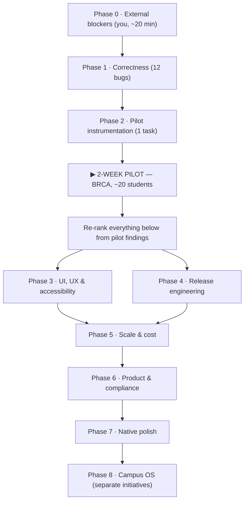

# LOOP — Execution Roadmap

**Project:** LOOP · Expo React Native + Firebase Firestore + Vercel Serverless
**Revised:** 5 September 2026 — every status below verified against the code, not assumed.

| | Count |
|---|---|
| ✅ Verified complete | **41** |
| 🔴 Open before the pilot | **17** (4 are account work, not code) |
| ⚪ Open after the pilot | **44** |
| **Total tracked** | **102** |

> **The headline: you are much closer than the old plan suggested.** Phases 2 and 3 of the previous
> version are essentially finished — the event contract, the dead-feature wiring, and the queue
> overhaul all landed. What actually stands between you and a pilot is 12 correctness bugs, one
> instrumentation task, and four things only you can do in a browser.

---

## The real critical path



Phases 3 and 4 are independent of each other; everything after the pilot should be re-ordered by
what the pilot actually surfaces.

---

# 🔴 Phase 0 · External blockers

*No code. Nothing downstream is stable until these clear.*

| ID | Item | Why it blocks |
|---|---|---|
| **B—01** | **Rotate the Gemini API key** | It is in public repo history at commit `d61170a`, 89 times — the scraper writes request URLs (which embed the key) into `scraper_bg.log`, and that log was committed. Treat as compromised. |
| **B—02** | **Gemini quota** — move to a paid tier or cut usage | `gemini-2.5-flash` returns `429 RESOURCE_EXHAUSTED`. This, not model choice, caused the 36–58s concierge latency. Quota is per-project, so B—01 does not fix it. |
| **B—03** | **Cloudinary key with upload permission** | Current key `4216…719` is rejected for both `create` and `read`. Every poster upload fails — scraper and Club Studio alike. This is why cards read "NOT AVAILABLE". |
| **B—04** | **GitHub Actions secrets** — all `EXPO_PUBLIC_FIREBASE_*` + `FIREBASE_SERVICE_ACCOUNT` | CI fails closed by design since the 4 Sep outage, when it shipped a bundle with `apiKey:""` over the live site. Nothing deploys until these exist. |

**Exit gate:** a fresh scraper run produces events with real Cloudinary URLs, and the concierge
answers in under 3 seconds.

---

# 🔴 Phase 1 · Correctness

*12 bugs found by running the system. Do them in this order — the data ones first, because
everything in the feed is downstream of what the scraper writes.*

### 1a · Ingestion integrity

- [ ] **F—59 · Scraper bypasses the moderation queue** — P0
  `scraper/scraper.py:248` writes `"status": "approved"  # Auto-approved for immediate feed visibility`.
  Every scraped post publishes straight to the student feed. This voids the Staging Queue, the
  `coordinator` claim, and the `pending → approved` rule in practice — the rules are not bypassed,
  they are simply never exercised, because the Admin SDK writes `approved` directly. It is why an
  admissions circular and a feedback form reached the live feed.
  **Fix:** write `pending`. If unattended publishing is genuinely wanted, gate it behind an explicit
  `--auto-approve` flag with a confidence floor — never the default.

- [ ] **F—51 · Year-rollover creates 2027 events**
  `scraper.py:265` — `if dt.month < datetime.now().month: dt = dt.replace(year=year + 1)`. In
  September, April and August posts become **2027**-04 and **2027**-08 and flood "Upcoming".
  **Fix:** only roll over in Nov/Dec looking at Jan/Feb. Archive genuinely past events.

- [ ] **F—52 · Duplicate events**
  Dedupe key is only `ig_{post_id}`, so the same event posted twice appears twice ("Debutant 11.0").
  **Fix:** dedupe on the normalised tuple `(title, host, date)`.

- [ ] **F—53 · Incomplete `invalid_markers`**
  `"not available"` and `"ongoing"` pass validation, so non-events get through.
  **Fix:** extend the marker list, and add an `is_event: true|false` field to the extraction schema.

- [ ] **Data cleanup · one-off, idempotent, dry-run by default**
  Purge the 2027 events, the duplicate "Debutant 11.0" docs, and the 15 posterless queued events so
  a clean run can re-ingest them. Depends on B—03.

### 1b · AI path

- [ ] **F—58 · Poster parsing is 100% broken** — P0
  `api/parseEventPoster.ts:44` uses `gemini-2.5-pro`, which returns **404 NOT_FOUND** on this API
  version. Not rate-limited — nonexistent. Every Club Studio upload silently falls back to manual
  entry.
  **Fix:** `gemini-2.5-flash-lite` (measured 1.1s), fallback `gemini-flash-lite-latest`.

- [ ] **F—48 · Model hierarchy**
  `TEXT_MODELS = ['gemini-2.5-flash', 'gemini-flash-lite-latest']` — the primary 429s on every call.
  **Measured 5 Sep:** `gemini-2.5-flash-lite` 1.1s · `gemini-flash-lite-latest` 1.2s. The 36–58s
  figures were **throttling under exhausted quota**, not a slow model, so reordering alone will not
  hold — **B—02 is the real dependency.**
  **Fix:** reorder to lite-first, and surface a "busy, try again" when every entry 429s.

- [ ] **Model list lives in one place**
  Three call sites, three different lists: `api/callGemini.ts`, `api/parseEventPoster.ts`,
  `scraper/shared.py:138`. They have already drifted. One shared constant.

- [ ] **F—49 · Concierge has no timeout**
  `src/utils/vercelClient.ts` has no abort signal, so a slow call leaves the UI on "Thinking…"
  forever.
  **Fix:** `AbortSignal.timeout(15000)` plus a real error message.

- [ ] **F—57 · Raw markdown in concierge output**
  The greeting renders literal `**Loop AI**`.

### 1c · Feed correctness

- [ ] **F—50 · Sort order and "Featured Tonight"**
  Events without `startsAt` evaluate to `0` (1 Jan 1970) and sort to the top, so `filtered[0]` — the
  "Featured Tonight" slot — showed an admissions circular dated 30 Mar.
  **Fix:** missing `startsAt` sorts last. Featured requires `featured: true` **or** a `startsAt`
  within 48h; otherwise hide the section entirely.

- [ ] **F—54 · Offline cache is empty**
  `JSON.parse` restores Firestore Timestamps as `{seconds, nanoseconds}` with no `.toDate()`, so
  `new Date(...)` yields `Invalid Date` and every cached event is dropped.
  **Fix:** one shared coercion helper used by every read path.

- [ ] **F—55 · Notifications fire for expired events**
  Runs on raw `liveEvents`. Filter first.

- [ ] **F—56 · Approval loses `startsAt`**
  Editing date/time in the queue updates the display strings but leaves `startsAt` null, so the
  event never sorts correctly after approval.

**Exit gate:** submit an event through Club Studio → it appears in the queue → approve it → it shows
under the right category chip, in the right chronological position, with a poster. Demonstrate the
whole chain.

---

# 🔴 Phase 2 · Pilot instrumentation

- [ ] **T—09 · Crash reporting** — needs a **Sentry DSN from you**
  Without it the pilot yields "it didn't work" and no stack trace. This is the difference between a
  pilot that produces data and one that produces anecdotes.

*Already done: T—08 ErrorBoundary · T—10 offline cache · T—11 scraper health heartbeat.*

---

# ⏸️ PILOT GATE — 2 weeks, BRCA, ~20 students

Everything below is speculative until this runs. Its output is a **ranked list of what broke**, and
that list re-orders every phase after it.

What only a pilot can tell you: layout on cheap Android screens, behaviour on campus Wi-Fi, whether
coordinators actually use the queue, whether Gemini's extraction is good enough on this month's real
posters, and where the confidence threshold belongs.

**Expect rough edges** — 9 UI items are still open by design. You are testing whether the loop
holds, not whether it looks finished.

---

# ⚪ Phase 3 · UI, UX & accessibility

- [ ] **F—31 · Accessibility sweep** — 12 labels across 138 `Pressable` elements. One systematic
      pass: labels, roles, states. The largest single item here.
- [ ] **F—29 · WhatsApp pill tap-through** — `e.stopPropagation()` is a no-op in RN touch handling,
      so the pill also opens the detail modal. Move it outside the card's press target.
- [ ] **F—30 · Double image decode** — one `Image` per card, not two of the same URL.
      *Superseded if X—02 (`expo-image`) is adopted — do one, not both.*
- [ ] **F—32 · Input font size ≥ 16px** — prevents iOS zoom-on-focus.
- [ ] **F—38 · Remove remaining demo persona** — "Aarav Sharma" placeholder in `StudentAuthModal`.
- [ ] **F—41 · Filter keyed by id, not display text** — the saved chip compares rendered strings, so
      a copy change breaks the filter.
- [ ] **F—37 · Directory open/closed from real hours** — currently a static field. A wrong "Open"
      sends someone across campus.
- [ ] **F—26 · `featured` / `day` / `fillingFast`** — still rendered but never written. Populate at
      write time or delete the UI. **Product decision.**

---

# ⚪ Phase 4 · Release engineering

- [ ] **T—04 · `expo-updates`** — ship fixes without a store review cycle.
- [ ] **T—05 · Production profile in `eas.json`** — currently `{}`: no channel, env, or autoIncrement.
- [ ] **T—07 · Cache headers in `firebase.json`** — long max-age for hashed assets, none for
      `index.html`.

*Already done: T—01 bundleIdentifier · T—02 `userInterfaceStyle: automatic` · T—03 scheme.*

---

# ⚪ Phase 5 · Scale & cost

- [ ] **T—13 · `FlatList` virtualization** — no `FlatList` exists; feeds are `ScrollView` + `.map()`,
      so every card mounts at once. With F—30 this is the scale ceiling.
- [ ] **T—16 · Archival / TTL** — nothing is ever deleted, so both queries grow without bound.
- [ ] **T—15 · Budget alarms** — Google Cloud, Vercel, Cloudinary. *(Account work.)*
- [ ] **F—43 · Collapse scraper entry points** — 12 Python files; `cli.py` and `shared.py` exist but
      the originals remain.

*Already done: T—12 pagination limits · T—14 Cloudinary transforms.*

---

# ⚪ Phase 6 · Product completeness & compliance

- [ ] **T—23 · Privacy policy & terms** — hard blocker for both app stores.
- [ ] **T—25 · Data deletion flow** — DPDP Act 2023; both stores require it independently.
- [ ] **T—24 · Ingestion posture** — **decide** whether scraping stays primary or becomes backfill
      behind club submissions. Instagram's ToS and poster copyright scale with public distribution.
      A risk-appetite call, not an engineering one.
- [ ] **T—17 · Push notification pipeline** — FCM/APNs, token store, sender. A project, not a fix.
- [ ] **T—22 · Club-scoped coordinator permissions** — restrict editing to a coordinator's own club.
- [ ] **T—18 · First-run onboarding** · **T—19 · Event sharing** (needs T—03) ·
      **T—20 · Report/flag** · **T—21 · Search backend** · **T—26 · Contrast & reduced motion** ·
      **T—27 · Firestore backups**

---

# ⚪ Phase 7 · Native polish

- [ ] **X—02 · `expo-image`** — best value here; supersedes F—30 and pairs with T—14.
- [ ] **X—01 · Universal links** — depends on T—03.
- [ ] **X—03 · Haptics** — cheap, lands well on the existing swipe-to-moderate gesture.
- [ ] **X—04 · Optimistic queue UI** — approve/reject currently blocks on a Firestore round-trip.
      *Note: saving an event has no network call, so optimism there buys nothing.*

> `react-native-reanimated` is deliberately excluded. The app uses RN `Animated` consistently and it
> works; migrating means rewriting it for smoothness nobody has reported. If scroll performance is a
> real pilot complaint, X—02 plus T—13 fix more of it at a fraction of the risk.

---

# ⚪ Phase 8 · Campus OS ("Garam Khoon")

**Features of this app** — fit the codebase, sequence `GK—01 → GK—03 → GK—02`:

- [ ] **GK—01 · Gate priority pass** — RSVP-issued token, gate instructions, walk time from hostel.
- [ ] **GK—03 · Volunteer gate scanner** — validates GK—01 tokens. *Depends on GK—01.*
- [ ] **GK—02 · Live headcount meter** — only meaningful once GK—03 feeds it. *Depends on GK—03.*
- [ ] **GK—04 · Fast filters** — Happening Today / Free Food / Fast-Track / Certified.
- [ ] **GK—06 · BSW emergency quick-dial** — smallest item here, highest goodwill.
- [ ] **GK—07 · Fest countdowns & celebrations in Pulse.**

**Separate products — not checklist rows:**

> **GK—05 (Campus Bazaar)** and **GK—08 (hostel lounges / chat)** are user-to-user marketplaces and
> open chat channels. They bring content moderation, dispute handling, harassment reporting, and —
> with Kerberos-derived identity attached — real DPDP exposure (T—25). Each needs its own moderation
> plan, data model and legal review **before** any code. Treat them as separate initiatives.

---

# Verification

Presence checks prove a line exists, not that the system works. **Every failure that reached
production here passed a grep** — the empty `apiKey` bundle, the fonts served as HTML, the 404
model. Assert on built output and live responses instead.

```bash
# Types — app and API
cd loop-app && npx tsc --noEmit && npx tsc --noEmit -p api/tsconfig.json

# No provider secret may reach the client bundle
grep -rnE "EXPO_PUBLIC_(GEMINI|CLOUDINARY_UPLOAD_PRESET)" loop-app/src loop-app/App.tsx

# No credential file may be tracked (this caught a real leak)
git ls-files | grep -iE 'serviceAccountKey|(^|/)\.env($|\.)|session\.json|\.log$'

# The BUILT bundle must carry a real Firebase config
cd loop-app && npm run build:web && grep -rq 'apiKey:""' dist && echo BROKEN || echo ok

# FONTS must be fonts, not the SPA fallback  → expect 00010000, not 3c21444f ("<!DO")
curl -s https://loop-iitd.web.app/assets/node_modules/@expo-google-fonts/geist/400Regular/*.ttf \
  | head -c 4 | xxd -p

# The API must reject anonymous callers  → expect 401
curl -s -o /dev/null -w "%{http_code}\n" -X POST \
  https://loop-app-iitd.vercel.app/api/callGemini -d '{}'

# Every Gemini model referenced must actually resolve (2.5-pro currently 404s)
grep -rhoE "gemini-[a-z0-9.-]+" loop-app/api loop-app/scraper | sort -u

# The scraper must write to the queue, not the feed
grep -n '"status"' loop-app/scraper/scraper.py     # expect 'pending', never 'approved'

# Refresh the knowledge graph after structural changes
graphify update .
```

### Look at the running app before calling a phase done

| Check | It is wrong if |
|---|---|
| Feed chronology | an event dated before today appears under "Upcoming" |
| Featured slot | "Featured Tonight" shows something that is not tonight |
| Duplicates | the same title appears twice from one handle |
| Images | any card reads "NOT AVAILABLE" |
| Concierge | "Thinking…" persists past ~15s with no error |
| Queue | a coordinator signs in and sees zero pending while Firestore has some |
| Offline | airplane mode shows an empty feed instead of the cache |

---

## Appendix · Verified complete (41)

Do not re-open these without re-testing.

**Event contract:** F—14 confidence scale · F—15 `serverTimestamp` · F—20 no base64 in Firestore ·
F—40 date picker · T—06 composite indexes

**Feature wiring:** F—10 category vocabulary · F—11 interests filter · F—12 notifications ·
F—13 past events dropped · F—16 Pulse from Firestore · F—17 real source handle ·
F—18 fallback poster removed · F—19 club identity from claim · F—21/F—22 shared `onSnapshot` ·
F—23 error states · F—24 queue stale closure · F—25 soft-reject + undo · F—27 caps logged ·
Queue lightbox · Queue inline editor · Universal cards (`categoryMeta`)

**UI:** F—28 fonts render in production · F—33 themed boot · F—34 Studio gated on the claim ·
F—35 unique tab ids · F—36 notification badge wired · F—39 avatar fallbacks · F—42 dead props purged

**Platform:** T—01 iOS bundle id · T—02 automatic appearance · T—03 deep-link scheme ·
T—08 ErrorBoundary · T—10 offline persistence · T—11 scraper heartbeat · T—12 query limits ·
T—14 Cloudinary transforms

**Consolidation:** F—44 canonical handle list (45) · F—45 duplicate parser removed ·
F—46 unused deps removed · F—47 CI typecheck
