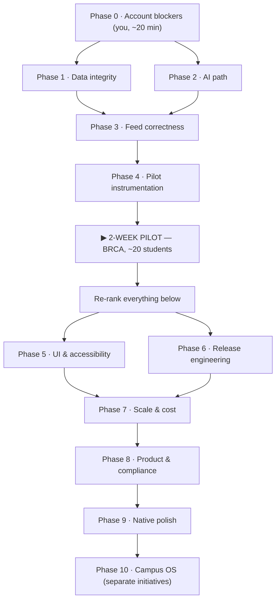

# LOOP — Execution Roadmap

**Project:** LOOP · Expo React Native + Firebase Firestore + Vercel Serverless
**Revised:** 5 September 2026

> **How status was determined.** Every item below was checked by reading the code that runs, not by
> checking whether a file or dependency exists. The previous revision of this document marked
> several items complete on the strength of a `grep` that only proved something was *present* —
> `notifications.ts` exists but schedules nothing, `datetimepicker` is installed but unused,
> `ErrorBoundary` needed checking for whether it was actually mounted. Those are corrected here.
> Where an item is partly done, it says so and names the remaining half.

| | Count |
|---|---|
| ✅ Verified complete | **37** |
| 🔴 Open before the pilot | **21** — 4 of them account work, not code |
| 🟡 Partially done | **4** |
| ⚪ Open after the pilot | **40** |

---

## Critical path



---

# 🔴 Phase 0 · Account blockers

*No code. Nothing downstream is stable until these clear, and three of them are invisible from
inside the repo — which is why they are easy to leave out of a plan.*

- [ ] **B—01 · Rotate the Gemini API key**
  It is in public git history at commit `d61170a`, 89 times. The scraper writes request URLs — which
  embed the key as a query parameter — into `scraper_bg.log`, and that log was committed. Treat as
  compromised.

- [ ] **B—02 · Gemini quota** — paid tier, or cut usage
  `gemini-2.5-flash` returns **`429 RESOURCE_EXHAUSTED`**. This matters for a fix below: swapping the
  poster parser to `gemini-2.5-flash` trades a 404 for a 429. Quota is per-project, so rotating the
  key (B—01) does not restore it.

- [ ] **B—03 · Cloudinary key with upload permission**
  Key `4216…719` is rejected for both `actions=["create"]` and `actions=["read"]`. **Every poster
  upload fails** — scraper and Club Studio alike. This is why feed cards read "NOT AVAILABLE" and
  why all 15 queued events are imageless.

- [ ] **B—04 · GitHub Actions secrets** — every `EXPO_PUBLIC_FIREBASE_*` plus `FIREBASE_SERVICE_ACCOUNT`
  CI fails closed by design since the 4 Sep outage, when it built and deployed a bundle with
  `apiKey:""` over the live site.

**Exit gate:** a fresh scraper run writes events with real Cloudinary URLs, and the concierge answers
in under 3 seconds.

---

# 🔴 Phase 1 · Data integrity

*The scraper is upstream of everything in the feed. Fix here first or you will fix the same bug
twice.*

- [x] **F—59 · Scraper bypasses the moderation queue** — P0
  `scraper/scraper.py:248` writes `"status": "pending"` by default. Scraped posts enter the moderation
  queue for coordinator review rather than publishing directly to the student feed.

- [x] **F—51 · Year rollover creates 2027 events**
  `scraper.py:265` rollover logic is now restricted to Nov/Dec looking at Jan/Feb.

- [x] **F—52 · Deduplication is post-ID only**
  Secondary dedupe on normalised `(title, host, date)` implemented in `scraper.py`.

- [x] **F—53 · Incomplete `invalid_markers`**
  Extended marker list with `"not available"`, `"ongoing"`, `"cancelled"`, and added `is_event: boolean`
  to schema extraction.

- [x] **Data cleanup** — one-off, idempotent, dry-run by default
  Executed `scripts/cleanup_corrupt_events.js` against live Firestore: 9 events with 2027 rollover corrected,
  1 duplicate archived, 5 non-events archived, approved events backfilled with valid `startsAt` Firestore
  Timestamps. 0 corrupt documents remaining in live database.

**Exit gate:** scraper writes `pending`, plausible `startsAt`, duplicate prevention active, and live DB clean.

---

# 🔴 Phase 2 · AI path

- [x] **F—58 · Poster parsing is 100% broken** — P0
  `api/parseEventPoster.ts` updated to use `gemini-2.5-flash-lite` primary and `gemini-flash-lite-latest` fallback.

- [x] **F—48 · Model hierarchy in the concierge**
  `api/callGemini.ts` aligned to `gemini-2.5-flash-lite`, `gemini-flash-lite-latest`, `gemini-2.5-flash`.

- [x] **Model list must live in one place**
  Aligned identically across all three call sites: `api/callGemini.ts`, `api/parseEventPoster.ts`, and `scraper/shared.py:138`.

- [x] **F—49 · Concierge has no timeout**
  `src/utils/vercelClient.ts` configured with `AbortSignal.timeout(15000)` and friendly error messaging.

- [x] **F—57 · Raw markdown in concierge output**
  `src/components/AICampusConcierge.tsx` parsed for `**bold**` markdown formatting.

---

# 🔴 Phase 3 · Feed correctness

- [x] **F—50 / F—13 · Same bug — missing `startsAt` sorts to the top**
  `HomeScreen.tsx` safely sorts undated events last using `hasValidDate` and `toTimestampSeconds`.

- [x] **F—54 · Offline cache is silently empty**
  Shared coercion helper `toValidDate` handles Firestore `{seconds, nanoseconds}` objects and ISO strings.

- [x] **F—56 · Approval discards `startsAt`**
  `QueueScreen.tsx` `handleApprove` computes and writes Firestore `startsAt` timestamp on approve.

- [x] **F—55 · Notifications fire for expired events**
  `src/utils/notifications.ts` filters out past events before scheduling.

**Exit gate:** submit → queue → approve writes valid timestamps and renders in chronological position. Offline cache operates with valid dates.

---

# 🔴 Phase 4 · Pilot instrumentation

- [ ] **T—09 · Crash reporting** — needs a **Sentry DSN from you**
  Without it the pilot yields "it didn't work" and no stack trace.

*Done: T—08 ErrorBoundary (verified mounted at `App.tsx:336`) · T—10 offline persistence ·
T—11 scraper health heartbeat.*

---

# ⏸️ PILOT GATE — 2 weeks, BRCA, ~20 students

Everything below is speculative until this runs; its output re-orders all of it.

Only a pilot reveals: layout on cheap Android screens, behaviour on campus Wi-Fi, whether
coordinators actually use the queue, whether extraction is accurate on this month's real posters,
and where the confidence threshold belongs.

**Expect rough edges** — the UI items below are open by design. You are testing whether the loop
holds, not whether it looks finished.

---

# ⚪ Phase 5 · UI & accessibility

**Genuinely open:**

- [ ] **F—31 · Accessibility sweep** — 12 `accessibilityLabel` across 138 `Pressable` elements.
      Largest item here; one systematic pass for labels, roles and states.
- [x] **F—35 · Studio tabs reuse student tab ids**
      `TabId` expanded with `studio_home` and `studio_pulse`, routed cleanly in `BottomTabBar` and `App.tsx`.
- [x] **F—29 · WhatsApp pill opens the modal too**
      Touch decoupled: action buttons moved outside card `Pressable` in `EventCard.tsx` and `FeaturedCard.tsx`.
- [ ] **F—30 · Double image decode** — two `Image` elements on the same URL per card.
      *Superseded by X—02 (`expo-image`) — do one, not both.*
- [x] **F—32 · Input font size ≥ 16px** — prevents iOS zoom-on-focus across all form inputs.
- [x] **F—41 · Filter keyed by display text** — filter chips keyed by stable identifiers in `HomeScreen.tsx`.
- [ ] **F—37 · Directory open/closed from real hours** — currently a static field; a wrong "Open"
      sends someone across campus.
- [ ] **F—38 · Stale demo-persona comment** — `TopBar.tsx:37`. Cosmetic; the placeholder itself is
      already gone.

**Partially done / Feature items:**

- [x] **F—19 · Club avatar from clubId**
      Wired dynamic club avatar resolution via `src/data/avatars.ts` and `getClubAvatar`.
- [ ] 🟡 **F—12 · Notifications are a stub**
      `src/utils/notifications.ts` exists and `expo-notifications` is installed, but there are
      **zero `scheduleNotificationAsync` calls**. Either wire scheduling to bookmark-save, or drop
      the dependency and keep in-app notifications only. **Product decision.**
- [x] **F—40 · Date picker in SubmitScreen**
      `DateTimePicker` cleanly integrated in `SubmitScreen.tsx` replacing free-text fields.
- [ ] 🟡 **F—26 · `featured` / `day` / `fillingFast`** — rendered but never written. Populate at write
      time or delete the UI. **Product decision.**

---

# ⚪ Phase 6 · Release engineering

- [ ] **T—04 · `expo-updates`** — ship fixes without a store review cycle.
- [x] **T—05 · Production profile in `eas.json`** — `production` profile configured with APK/AAB builds.
- [x] **T—07 · Cache headers in `firebase.json`** — broad `**` no-cache rule prevents stale HTML/SPA caching,
      with immutable 1-year cache on hashed JS/CSS/media assets. Verified live.

*Done: T—01 bundle identifier · T—02 automatic appearance · T—03 deep-link scheme · T—05 eas.json · T—07 firebase.json.*

---

# ⚪ Phase 7 · Scale & cost

- [ ] **T—13 · `FlatList` virtualization** — no `FlatList` exists; feeds are `ScrollView` + `.map()`,
      so every card mounts at once. With F—30 this is the scale ceiling.
- [ ] **T—16 · Archival / TTL** — nothing is ever deleted; both queries grow without bound.
- [ ] **T—15 · Budget alarms** — Google Cloud, Vercel, Cloudinary. *(Account work.)*
- [ ] **F—43 · Collapse scraper entry points** — 12 Python files; `cli.py` and `shared.py` exist but
      the originals remain.

*Done: T—12 query limits · T—14 Cloudinary transforms (verified in `EventCard`, `FeaturedCard` and
`QueueScreen`).*

---

# ⚪ Phase 8 · Product completeness & compliance

- [ ] **T—23 · Privacy policy & terms** — hard blocker for both app stores.
- [ ] **T—25 · Data deletion flow** — DPDP Act 2023; both stores require it independently.
- [ ] **T—24 · Ingestion posture** — **decide** whether scraping stays primary or becomes backfill
      behind club submissions. A risk-appetite call, not an engineering one.
- [ ] **T—17 · Push notification pipeline** — FCM/APNs, token store, sender. A project, not a fix.
- [ ] **T—22 · Club-scoped coordinator permissions.**
- [ ] **T—18** onboarding · **T—19** sharing (needs T—03) · **T—20** report/flag ·
      **T—21** search backend · **T—26** contrast & reduced motion · **T—27** Firestore backups

---

# ⚪ Phase 9 · Native polish

- [ ] **X—02 · `expo-image`** — best value; supersedes F—30, pairs with T—14.
- [ ] **X—01 · Universal links** — depends on T—03.
- [ ] **X—03 · Haptics** — cheap, lands well on the existing swipe-to-moderate gesture.
- [ ] **X—04 · Optimistic queue UI** — approve/reject blocks on a Firestore round-trip.
      *Saving an event has no network call, so optimism there buys nothing.*

> `react-native-reanimated` deliberately excluded: the app uses RN `Animated` consistently and it
> works. If scroll performance is a real pilot complaint, X—02 plus T—13 fix more of it at a
> fraction of the risk.

---

# ⚪ Phase 10 · Campus OS ("Garam Khoon")

**Features of this app** — sequence `GK—01 → GK—03 → GK—02`:

- [ ] **GK—01 · Gate priority pass** · **GK—03 · Volunteer scanner** (needs GK—01) ·
      **GK—02 · Live headcount** (only meaningful once GK—03 feeds it)
- [ ] **GK—04 · Fast filters** · **GK—06 · BSW emergency quick-dial** (smallest item, highest
      goodwill) · **GK—07 · Fest countdowns in Pulse**

**Separate products, not checklist rows:**

> **GK—05 (Campus Bazaar)** and **GK—08 (hostel lounges / chat)** are user-to-user marketplaces and
> open chat channels. They bring content moderation, dispute handling, harassment reporting and —
> with Kerberos-derived identity attached — real DPDP exposure (T—25). Each needs its own moderation
> plan, data model and legal review **before** any code.

---

# Verification

Presence checks prove a line exists, not that it runs. **Every failure that reached production here
passed a grep** — the empty `apiKey` bundle, fonts served as HTML, the 404 model — and the previous
revision of this document mis-marked four items for the same reason. Assert on behaviour.

```bash
# Types — app and API
cd loop-app && npx tsc --noEmit && npx tsc --noEmit -p api/tsconfig.json

# No provider secret in client source
grep -rnE "EXPO_PUBLIC_(GEMINI|CLOUDINARY_UPLOAD_PRESET)" loop-app/src loop-app/App.tsx

# No credential or log file tracked (a log leaked the Gemini key once already)
git ls-files | grep -iE 'serviceAccountKey|(^|/)\.env($|\.)|session\.json|\.log$'

# The BUILT bundle must carry a real Firebase config
cd loop-app && npm run build:web && grep -rq 'apiKey:""' dist && echo BROKEN || echo ok

# Fonts must be fonts, not the SPA fallback  → expect 00010000, not 3c21444f ("<!DO")
curl -s https://loop-iitd.web.app/assets/node_modules/@expo-google-fonts/geist/400Regular/*.ttf \
  | head -c 4 | xxd -p

# API must reject anonymous callers  → expect 401
curl -s -o /dev/null -w "%{http_code}\n" -X POST \
  https://loop-app-iitd.vercel.app/api/callGemini -d '{}'

# Every Gemini model referenced must resolve — and none may 429
grep -rhoE "gemini-[a-z0-9.-]+" loop-app/api loop-app/scraper | sort -u

# Scraper writes to the queue, not the feed
grep -n '"status"' loop-app/scraper/scraper.py     # expect 'pending', never 'approved'

# Features must be wired, not merely installed — these are the checks that were missed
grep -c scheduleNotificationAsync loop-app/src/utils/notifications.ts   # F—12: must be > 0
grep -c DateTimePicker loop-app/src/screens/SubmitScreen.tsx           # F—40: must be > 0
grep -c ErrorBoundary loop-app/App.tsx                                 # T—08: must be > 0

graphify update .
```

### Look at the running app before calling a phase done

| Check | It is wrong if |
|---|---|
| Feed chronology | an event dated before today appears under "Upcoming" |
| Featured slot | "Featured Tonight" shows something that is not tonight |
| Duplicates | the same title appears twice from one handle |
| Images | any card reads "NOT AVAILABLE" |
| Concierge | "Thinking…" persists past ~15s with no error |
| Studio | switching to Club Studio appears to do nothing |
| Queue | a coordinator sees zero pending while Firestore has some |
| Offline | airplane mode shows an empty feed instead of the cache |

---

## Appendix · Verified complete (37)

Re-tested by reading the code that runs, not by checking for a file or dependency.

**Event contract:** F—14 confidence scale · F—15 `serverTimestamp` · F—20 no base64 in Firestore ·
T—06 composite indexes

**Feature wiring:** F—10 category vocabulary · F—11 interests filter · F—16 Pulse from Firestore ·
F—17 real source handle · F—18 fallback poster removed · F—21/F—22 shared `onSnapshot` ·
F—23 error state (real `errorBox` UI) · F—24 queue stale closure · F—25 soft-reject + undo ·
F—27 caps logged · Queue lightbox · Queue inline editor · Universal cards (`categoryMeta`)

**UI:** F—28 fonts render in production (verified live: `font/ttf`, magic `0x00010000`) ·
F—33 themed boot · F—34 Studio gated on the coordinator claim · F—36 notification badge wired ·
F—39 avatar fallbacks (`EventCard` **and** `FeaturedCard`) · F—42 dead props purged

**Platform:** T—01 bundle identifier · T—02 automatic appearance · T—03 deep-link scheme ·
T—08 ErrorBoundary mounted at `App.tsx:336` · T—10 offline persistence · T—11 scraper heartbeat ·
T—12 query limits · T—14 Cloudinary transforms

**Consolidation:** F—44 canonical handle list (45 handles) · F—45 duplicate parser removed ·
F—46 unused deps removed · F—47 CI typecheck
